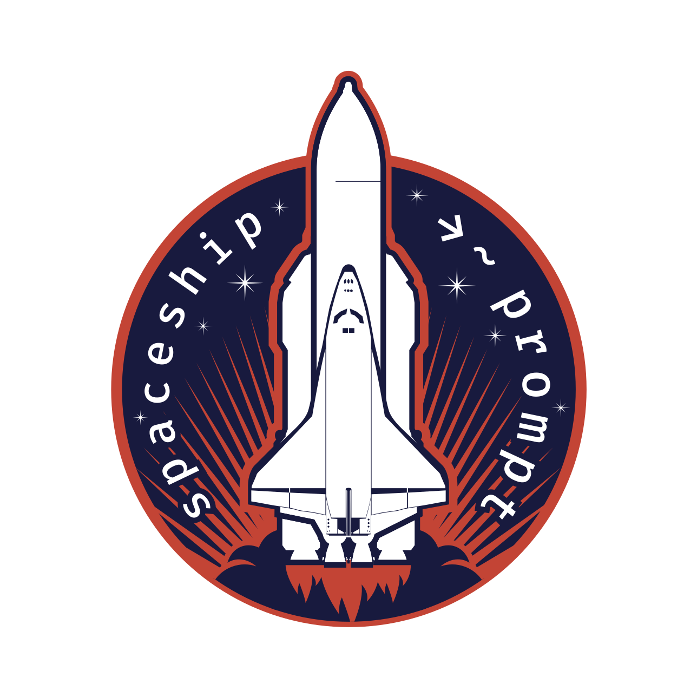
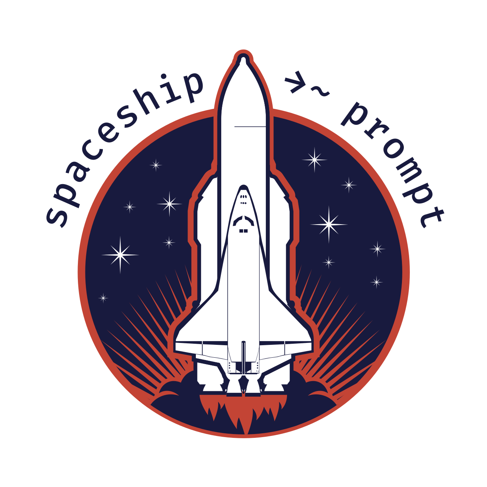

# Spaceship Brand

> 🚀 Logo and colors forming Spaceship brand

This repo contains Spaceship's brand materials, like colors and logos.

## Colors

Main colors of Spaceship's logo are:

* `#FFFFFF` — white
* `#C44436` — red
* `#181A3F` — blue

## Logo

The logo contains an image of [Soviet spacecraft "Buran"](https://en.wikipedia.org/wiki/Buran_(spacecraft)) (meaning "Snowstorm" or "Blizzard"). This aircraft was built in 80s by group of soviet scientists lead by an Ukrainian engineer, scientist and designer [Gleb Lozino-Lozinskiy](https://en.wikipedia.org/wiki/Gleb_Lozino-Lozinskiy).

Here's a Buran during launch of flight 1K1 on 15 November 1988:

The logo also reassembles [historic logos and patches of NASA's missions](https://www.nasa.gov/centers/armstrong/multimedia/imagegallery/logos_patches/index.html).

### Letters Outlined

### Letters Outside

### No Letters

## License

[CC-BY-NC][cc-url] © Denys Dovhan

<!-- References -->

[cc-url]: https://creativecommons.org/licenses/by-nc/4.0/
[cc-image]: https://img.shields.io/badge/License-CC%20BY%20NC%204.0-lightgrey.svg?style=flat-square]